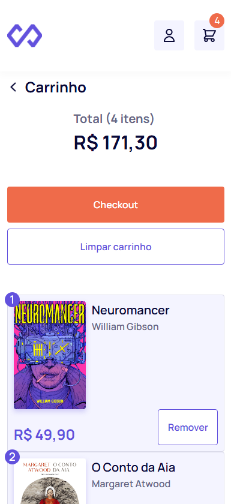

# :books: LivrariaVirtual-INJunior25.1
E-Commerce de Livraria Virtual  
Single Page Application desenvolvida em React/TypeScript  
       

## Features
- 100% funcional (Validação Login, API Fetching com global states, Páginas, Carrinho)
- Desafio completo (Carrinho de Compras, com global states)
- Armaazenamento via LocalStorage (para o carrinho)
- Design totalmente responsivo 
- Estilização idêntica ao conceito do Figma
- Repleto de Animações 

## Bibliotecas usadas
- react-router-dom
- react-hook-form
- zod + @hookform/resolvers
- zustand
- axios
- json-server


## Instalação
1. Clone o repositório:
   ```sh
   git clone https://github.com/yourusername/INFeed-INJunior25.1.git
2. Abra o terminal na pasta do repositório e execute:
   ```sh
   npm install
3. Execute para testar:
   ```sh
   npm run dev
4. Rode o json-server para o fetching de Livros:
   ```sh
   npx json-server --watch livros.json 3000

## Desenvolvido com <3 por
[Leandro Bertholdo](https://github.com/berthrage) 
   
